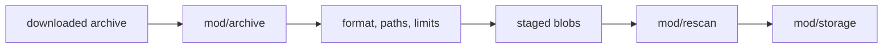

# mod/archive

`mod/archive` turns a downloaded release archive into a staged file tree. It does not decide which versions to mirror
and it does not commit durable state. Its job is to parse archive formats safely, enforce archive limits, and produce
staged entries and blob files for `mod/rescan` and `mod/storage`.

## Place in the Runtime

## Responsibilities

- Read `zip`, `tar`, and `tar.gz` inputs.
- Reject path traversal, unsafe names, unsupported entry types, and size-limit violations.
- Drop symlink entries whose targets would escape the staged tree.
- Write blob payloads into the caller-provided spool directory.
- Return canonical staged entries with path, mode, hash, and size.
- Preserve enough error detail for rescan diagnostics.

## Contracts

- Archive extraction is bounded by configured compressed size, unpacked size, file count, path length, and per-file
  size limits.
- Symlinks are represented as entries with link target bytes only after the target passes the archive tree check.
  Unsafe symlink targets are omitted from the staged tree and reported in the extraction result.
- The package must not trust archive metadata without checking the actual bytes read.
- The output tree is staged, not published. `mod/storage.PublishStaged` is the durability boundary.

## Important Files

- `obj.go`: archive object and public extraction entry.
- `zip.go`, `tar.go`: format-specific readers.
- `write.go`: staged blob writing and hash calculation.
- `helper.go`: path and mode helpers.

## Operational Notes

Archive parsing is an abuse boundary. Keep new format support conservative and make every new entry type explicit.
Silent best-effort extraction is not acceptable because the result becomes package-manager input. Symlink drops are the
only tolerated partial extraction path: the unsafe link is excluded, while the remaining tree can still be validated by
rescan and storage.
