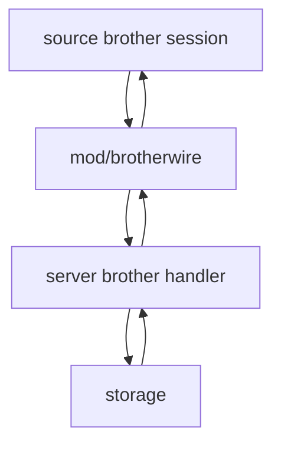

# mod/brotherwire

`mod/brotherwire` defines the net/rpc wire contract used between yggvault nodes. It is intentionally small: DTOs,
method names, default caps, and the protocol version live here; dialing, validation, and storage access live in
`mod/source`, `mod/rescan`, and `mod/server/brother`. The public API fallback for brothers does not use this package;
it reads normal release metadata and artifact routes.

## Place in the runtime

## Responsibilities

- Define the protocol version returned by `Brother.Hello`.
- Define RPC method names and service name.
- Define gob-serializable DTOs for index pages, version trees, and blob batches.
- Define default blob-fetch caps used when config or older peers do not provide explicit limits.
- Keep hash representation wire-neutral with a fixed 24-byte array.

## Contracts

- `Protocol` changes when old and new nodes cannot safely talk.
- New gob fields must be backward-compatible or require a protocol bump.
- `DefaultMaxFetchResponseBytes` must stay aligned with storage's absolute single-blob cap unless the storage format
  changes.
- `Hello` limit fields are negotiated defensively: a zero value means "use the local/default cap", and clients batch by
  the lower local/remote value.
- DTOs must not import runtime packages other than this package's own constants.

## Important files

- `wire.go`: constants, DTOs, method names, and `BrotherInterface`.

## Operational notes

This package should remain boring. Complex validation belongs on both sides of the wire: the server advertises and
enforces configured caps before sending, and the client revalidates sizes, hashes, page order, and source info before
trusting a peer.
