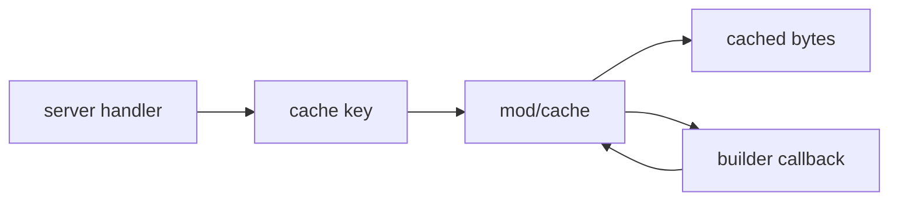

# mod/cache

`mod/cache` is a bounded in-memory byte cache for small generated responses. It is used for metadata payloads and
HTML/API bodies where rebuilding is more expensive than storing a short byte slice. It is not used for large archives;
those are served from storage hot files.

## Place in the Runtime

## Responsibilities

- Store immutable byte slices under caller-defined keys.
- Bound memory use by total byte size.
- Evict least-recently-used entries when the budget is exceeded.
- Expose low-cardinality counters for hits, misses, inserts, evictions, and bytes.
- Keep cache policy separate from the domain builders that produce the bytes.

## Contracts

- Callers must include all freshness inputs in the key or surrounding ETag logic.
- Values are copied before storage so later caller mutation cannot corrupt cached bytes.
- The cache is process-local and disposable. Durable state belongs in `mod/storage`.
- Detached cache builds share `cache.build_max_parallel` with the server typed-object cache.
- This package does not know HTTP semantics; `Cache-Control`, `ETag`, and `If-None-Match` are handled in `mod/server`.

## Important Files

- `obj.go`: cache object, configuration, entry accounting.
- `cache.go`: get, set, and build operations.
- `shard.go`: shard-local LRU maintenance.
- `metrics.go`: telemetry producer for cache metrics.
- `gate.go`: shared admission gate for detached byte-cache and server typed-cache builds.

## Operational Notes

Use this cache only for small responses. Large artifact bytes would displace useful metadata and duplicate hot-file
storage in RAM. The configured size should cover the working set of catalog, version, Composer, Go proxy, and HTML
metadata responses.

The server's typed object cache is separate and lives in `mod/server/objcache.go`; it shares the build gate but is not
part of this byte cache.

Set `cache.build_max_parallel` low on small nodes and high on read-heavy nodes with enough CPU and storage IO. The gate
caps concurrent cold builds across cache keys; it does not limit already-cached response serving.
