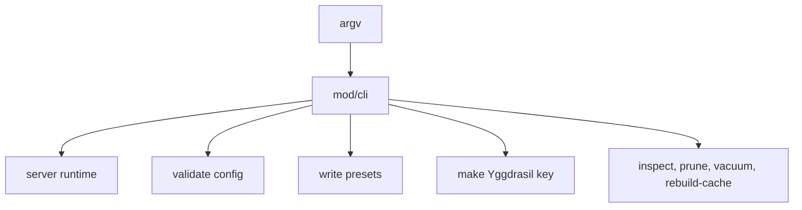

# mod/cli

`mod/cli` parses command-line arguments and selects the top-level process mode. It is the boundary between user input
and runtime assembly: server start, config validation, preset generation, key generation, storage inspection, and
maintenance all begin here.

## Place in the runtime

## Responsibilities

- Parse flags and positional config paths.
- Return a typed command for the root runtime instead of starting subsystems directly.
- Keep CLI output and errors in English.
- Support `--json` output envelopes for automation.
- Route maintenance commands to storage-only paths that require exclusive access.

## Contracts

- CLI parsing must not open storage, start mesh, or start HTTP listeners.
- Maintenance commands must validate that they have enough input before touching storage.
- `--make-preset`, `--validate-config`, and `--make-ygg-key` are one-shot commands and should not assemble the server.
- User-facing command text is part of the operator interface and should remain stable.

## Important files

- `obj.go`: command object and parser entry.
- `helper.go`: flag parsing and command validation.
- `meta.go`: help and info output data.
- `render.go`: terminal and JSON rendering.
- `error.go`: CLI error wrapping and output.

## Operational notes

Prefer explicit commands in automation. `yggvault <config>` is convenient for humans; `yggvault --config <config>` is
clearer in service units and scripts.
