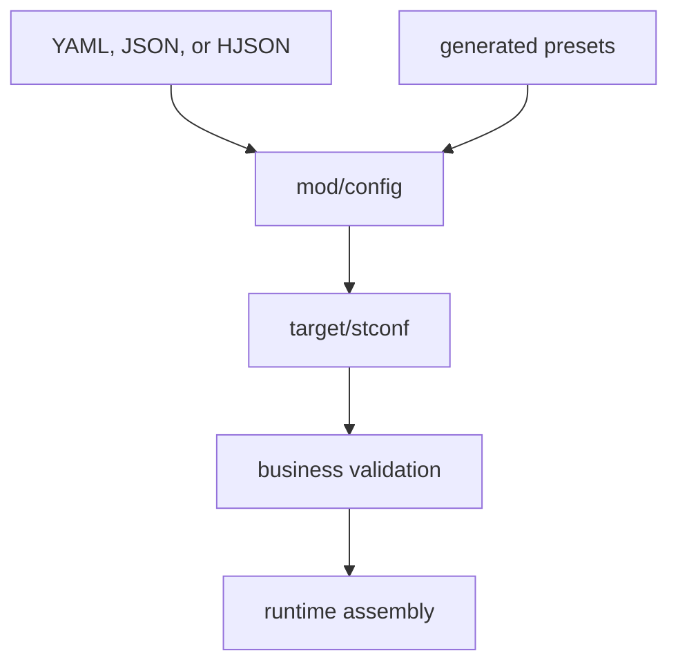

# mod/config

`mod/config` loads and validates runtime configuration before any long-lived subsystem starts. Schema-level parsing is
generated into `target/stconf`; this package adds file handling, preset loading, and business validation that depends
on multiple config sections.

## Place in the runtime

## Responsibilities

- Detect config format from the file extension.
- Decode YAML, JSON, and HJSON into generated config structs.
- Apply defaults and schema validation through `target/stconf`.
- Validate cross-section business rules such as listener modes, TLS pairs, static routing, profiling bind address,
  storage limits, and rate-limit budgets.
- Load generated presets for CLI commands.

## Contracts

- A config is either valid before runtime assembly or the process exits with an English error.
- Validation must catch unsafe public pprof binds and inconsistent web listener settings.
- Generated files in `target/stconf` are source-of-truth for schema defaults and field documentation.
- Business validation should stay deterministic and should not perform network calls.

## Important files

- `init.go`: generated parser entry and business-validation handoff.
- `helper.go`: shared patterns, reserved keys, and validation constants.
- `validate.go`: cross-section validation.
- `config_test.go`: format, default, and cross-section validation coverage.
- `profiling_test.go`: profiling-listener safety coverage.

## Operational notes

When adding a new config field, update the schema in `yml/config`, regenerate `target/stconf`, and add business
validation here only if the rule cannot be expressed in the schema.
