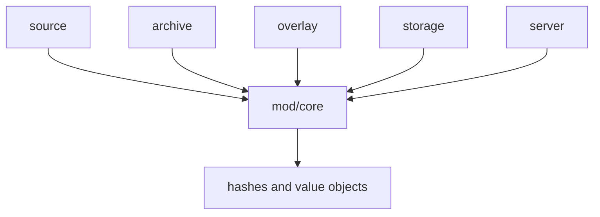

# mod/core

`mod/core` defines the shared value objects used by the rest of the runtime. It has no storage, network, or
configuration side effects. Packages depend on it for stable names for hashes, tree entries, artifact descriptors,
version metadata, diagnostics inputs, and small formatting helpers.

## Place in the runtime

`mod/core` sits below the domain packages. It keeps the common vocabulary in one place so `source`, `archive`,
`overlay`, `storage`, and `server` do not copy wire-neutral structs.

## Responsibilities

- Represent BLAKE3-24 content hashes and provide deterministic formatting.
- Represent version trees as path, mode, blob hash, and size entries.
- Describe artifacts, listeners, source metadata, and publish inputs shared across packages.
- Keep semver and raw-version value checks close to the core model.
- Provide canonical time formatting used by generated API responses.

## Contracts

- Hashes are fixed-size values. The zero hash is a sentinel and should not be stored as real content.
- Tree entries are canonical data, not filesystem paths. Callers must validate archive paths before creating them.
- Version metadata is the storage-facing shape. Public API packages should project it into response-specific DTOs.
- Comments on fields document non-obvious invariants such as sequence ordering, verification timestamps, and blocked
  Go module zip state.

## Important files

- `hash.go`: BLAKE3-24 hashing, parsing, and formatting.
- `tree.go`, `staged.go`: canonical tree and staged publish DTOs.
- `version.go`: version metadata, deletion state, Go overlay block state, upstream sequence fields.
- `artifact.go`: artifact kind, listener binding, digest metadata.
- `time.go`: canonical timestamp formatting used by API and HTML builders.
- `history.go`, `report.go`: shared history and integrity-report value objects.

## Usage notes

Keep this package dependency-light. It is safe for low-level packages to import `mod/core`, but adding dependencies
from `core` back to storage, server, config, or source would create cycles and blur the shared model boundary.
