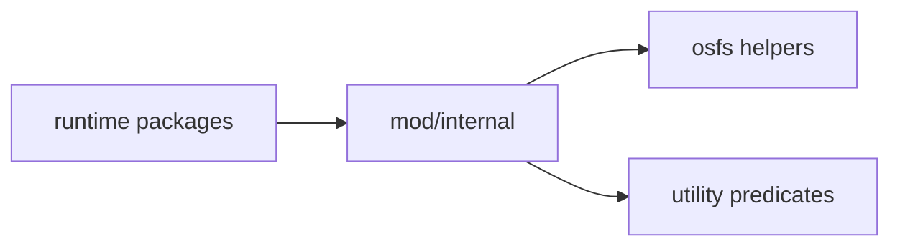

# mod/internal

`mod/internal` contains helpers that are useful across packages but should not become public API. It currently groups
filesystem utilities and small string/version helpers behind Go's `internal` import boundary.

## Place in the Runtime

## Responsibilities

- Provide filesystem helpers for atomic writes, directory sizing, path checks, and system memory inspection.
- Provide shared version-name predicates that do not belong to `mod/core`.
- Provide small shared building blocks reused across packages (FNV string hashing, a generational map) so map
  sharding and bounded-eviction logic is written once instead of duplicated.
- Keep implementation helpers out of public package surfaces.

## Contracts

- Helpers must be deterministic and side-effect-light unless their name clearly describes filesystem mutation.
- Filesystem helpers should avoid following attacker-controlled paths outside caller-approved roots.
- Utility predicates used by storage and rescan must have identical behavior across both packages.

## Important Files

- `osfs/`: filesystem and OS-level helpers.
- `util/`: version/path predicates plus small shared helpers (`hash.go` FNV, `genmap.go` generational map).

## Operational Notes

Do not move domain logic here just to avoid an import cycle. If a helper understands releases, storage commits, HTTP
semantics, or Yggdrasil behavior, it belongs in the owning package.
