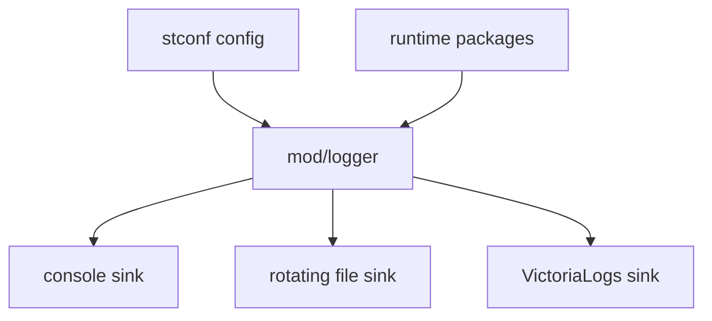

# mod/logger

`mod/logger` builds the process logger from configuration. It wires console output, rotating file output, and optional
VictoriaLogs shipping into one logger used by runtime packages.

## Place in the runtime

## Responsibilities

- Build a structured logger from `logging.*` config.
- Normalize sink levels and disabled sinks.
- Configure log file rotation limits.
- Keep user-facing log messages in English.
- Provide a no-surprise logger for startup, runtime, and maintenance commands.

## Contracts

- Logger construction should not start the main runtime.
- A disabled sink must not allocate background workers.
- Remote logging failures must not crash the mirror. They are operational degradation, not data corruption.
- Logs should use stable, low-cardinality fields such as component, key, version, and request id.

## Important files

- `obj.go`: logger construction and sink selection.
- `helper.go`: sink helpers and level parsing.
- `victorialogs.go`: VictoriaLogs sink delivery.

## Operational notes

Use file logging for persistent node diagnostics. Console logging is usually enough for containers. VictoriaLogs is
optional and should be treated as best-effort telemetry.
