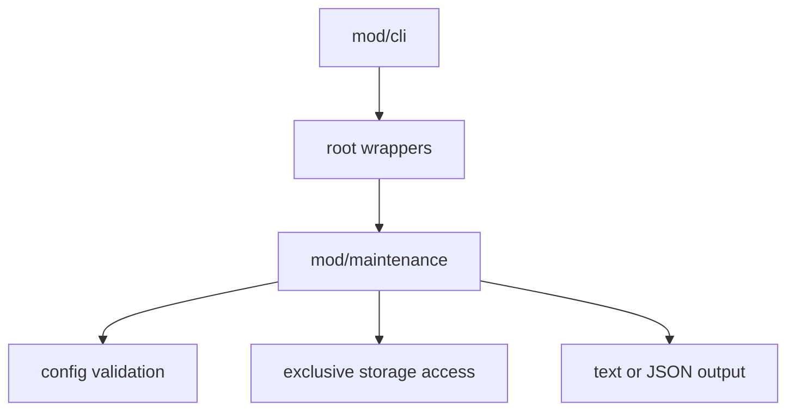

# mod/maintenance

`mod/maintenance` contains storage-only commands that run outside the serving runtime. The root `main` and `runtime`
files keep thin wrappers for CLI wiring, signal handling, and user output; the command behavior lives here.

## Place in the runtime

## Responsibilities

- Inspect durable storage and report versions, sizes, and orphan estimates.
- Prune keys removed from `release_mirrors`.
- Run SQLite vacuum and Pebble compaction.
- Rebuild hot artifacts and digest helpers from durable storage.
- Render maintenance errors in text or JSON without starting web, mesh, rescan, or telemetry runtime services.

## Contracts

- Maintenance commands require exclusive storage access.
- Root wrappers may adapt CLI input, context cancellation, and process output, but they must not reimplement command
  logic.
- JSON output must return structured English errors. Repair-prune failures use the same JSON error envelope as other
  maintenance failures.
- Maintenance must treat hot files as regenerable and Pebble/SQLite as durable truth.

## Important files

- `obj.go`: command request, typed errors, and shared command constants.
- `run.go`: command dispatcher and output mode handling.
- `selftest.go`: artifact layout checks used before rebuild-sensitive operations.
- `rebuild.go`: hot artifact and digest rebuild flow.
- `keysource.go`: key source reconciliation.
- `render.go`: text and JSON rendering helpers.

## Operational notes

Stop the running server before `inspect`, `prune`, `vacuum`, or `rebuild-cache`. These commands intentionally avoid the
normal runtime graph so they can fail early when storage is locked and so automation receives deterministic output.
