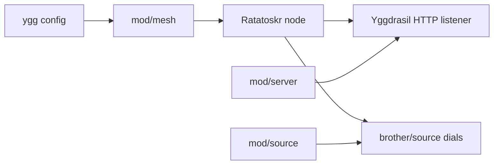
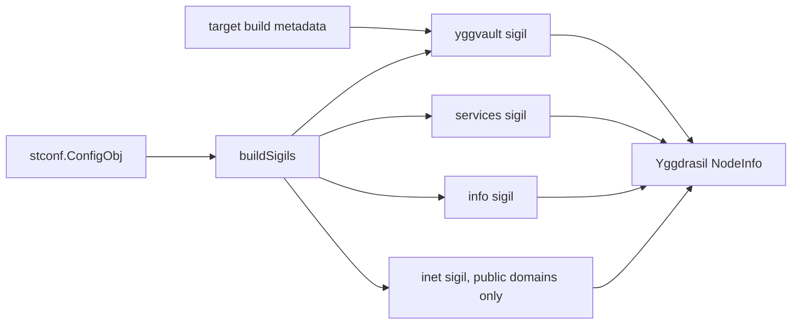

# mod/mesh

`mod/mesh` owns the embedded Yggdrasil node. It creates the Ratatoskr-backed userspace network stack, exposes the
node's `.pk.ygg` identity, and gives the rest of the runtime `DialContext` and listener access for mesh traffic.

## Place in the Runtime



## Responsibilities

- Load or validate the node private key.
- Start Ratatoskr with either static peers or peer manager config.
- Expose the node address, host, and listener state to server and view context.
- Provide mesh dialing for `.pk.ygg` targets.
- Publish Ratatoskr NodeInfo sigils for service discovery and node identity.
- Close the embedded node cleanly during runtime shutdown.

## NodeInfo Sigils

Ratatoskr publishes Yggdrasil NodeInfo through small named blocks called sigils. `mod/mesh` builds those blocks once
during node startup and passes them to the embedded Ratatoskr node. Every sigil is public: any mesh peer that can read
NodeInfo can see the same data.



The mesh layer publishes these sigils:

| Sigil      | Source                                     | Purpose                                                                           |
|------------|--------------------------------------------|-----------------------------------------------------------------------------------|
| `yggvault` | Generated `target` build metadata          | Project-owned build fingerprint for yggvault peers and diagnostics.               |
| `services` | Fixed mesh HTTP port                       | Advertises `http:80` for the Yggdrasil entry.                                     |
| `info`     | `info.*` config plus derived fallback name | Publishes the public node card also returned by `/info`.                          |
| `inet`     | `web.server.domain`                        | Advertises the public web domain only when it is not local, private, or loopback. |

The `yggvault` sigil is the custom, project-owned sigil. It uses the top-level NodeInfo key `yggvault` and carries only
build identity:

```json
{
  "yggvault": {
    "version": "v0.1.7",
    "hash": "build-hash",
    "date": "2026-07-04"
  }
}
```

Those values come from generated `target` metadata, not from operator config. A peer can use the block to identify that
the remote node claims to run yggvault, show the advertised build version, compare deployment hashes, or apply
peer-specific diagnostics. It is not an authorization mechanism, a release-integrity proof, or a substitute for archive
hashes. Treat it as public self-description attached to the Yggdrasil node identity.

`mod/mesh/yggvault` implements the Ratatoskr `sigils.Interface`: it can render the block, merge it into a NodeInfo copy,
parse the block from another node, and match only when `version`, `hash`, and `date` are present as strings. Its public
constructor accepts explicit build fields instead of importing generated `target` metadata, and `Parse` accepts foreign
NodeInfo for diagnostics and discovery. The parser keeps unknown sibling NodeInfo keys out of the returned fragment, so
callers can reason about the yggvault block without accidentally depending on unrelated sigils.

## Contracts

- If `ygg.pem_key` is empty, mesh is disabled and `.pk.ygg` dials must fail explicitly.
- Yggdrasil addresses are IPv6 and must be bracketed in URLs.
- Mesh links are treated as constrained links: all dials and requests need deadlines, bounded retries, and bounded
  response sizes.
- The package should use the Ratatoskr root API unless a lower-level package genuinely needs a core contract.
- NodeInfo sigils must not contain secrets, credentials, private upstream URLs, or operator-only diagnostics.
- The `yggvault` sigil must stay backward-compatible: peers should be able to detect the block by top-level key and read
  `version`, `hash`, and `date` as strings.
- `mod/mesh/yggvault` is the public sigil contract. Runtime wiring may feed it generated build metadata, but the
  package itself must stay usable without importing generated `target` code.

## Important Files

- `obj.go`: mesh object and public methods.
- `host.go`: host derivation from Yggdrasil keys.
- `dial.go`: Yggdrasil dial and listener adapters.
- `sigils.go`: NodeInfo sigil construction and public identity validation.
- `yggvault/`: small adapter package for Yggdrasil-specific runtime wiring.

## Operational Notes

The mesh entry is an additional transport for the same service, not a separate data plane. It should behave like the
web entry except for listener identity, route labels, and Yggdrasil-specific dialing constraints. Brother RPC
availability is controlled by the server config, not by `mod/mesh`.
