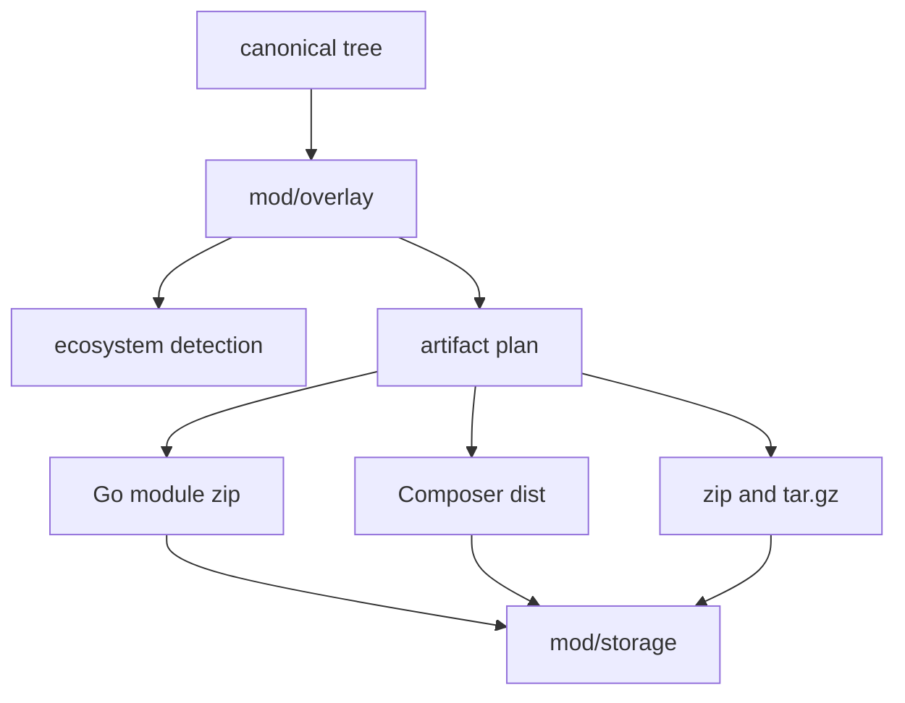

# mod/overlay

`mod/overlay` turns a canonical version tree into package-manager artifacts and metadata. It detects Go and Composer
packages, rewrites Go module paths for Go proxy artifacts when enabled, plans raw universal archives, and builds
artifact bytes from storage.

## Place in the runtime

## Responsibilities

- Detect whether a tree is Go-publishable, Composer-publishable, both, or neither.
- Rewrite Go module paths and imports for the configured public module path in Go proxy module zips.
- Reject trees that cannot become valid Go module zips.
- Build Go proxy `.mod`, `.info`, and `.zip` artifacts.
- Build Composer metadata and dist archives.
- Build raw universal `.zip` and `.tar.gz` artifacts with top directory `<key>-<version>/`.
- Render install snippets and integrity hints used by the HTML UI.

## Contracts

- Detection must be deterministic from tree contents and listener/domain context.
- Go zip validity follows `golang.org/x/mod/zip` constraints, including fold collisions and invalid names.
- Symlink trees are not Go-publishable.
- Go module path rewrite is size-stable by contract: the size reported to `modzip.Create` must equal the length of the
  content later opened for the same file. `rewriteContent` and `rewrittenSize` share one scanner to keep this invariant.
- Builders must not trust staged files after validation; storage reopens and verifies staged content before commit.
- Artifact identifiers include listener id when output depends on host or scheme; raw universal archives use the global
  listener id.

## Important files

- `detect.go`, `goviability.go`: ecosystem detection and Go zip viability.
- `rewrite.go`: Go module path and import rewriting.
- `plan.go`, `materialize.go`: artifact planning and materialization.
- `gorender.go`, `gozip.go`, `composer.go`, `universal.go`: domain builders.
- `snippet.go`: UI install snippets.
- `interface.go`: storage and reader seams.

## Operational notes

Overlay code is intentionally strict. A tree that is valid as a universal archive can still be blocked for Go if it
would produce a module zip that Go tooling rejects. The version remains published; only Go-specific artifacts are
disabled.

Go zip block reasons are grouped into stable categories before they are persisted. Known `x/mod/zip` invalid-path,
collision, and size-limit errors keep their existing labels. Unknown future invalid errors use
`unclassified module zip errors`; `mod/rescan` counts that label with `rescan_go_zip_unclassified_total` so dependency
wording drift is visible after upgrades instead of being silently merged into invalid paths.
