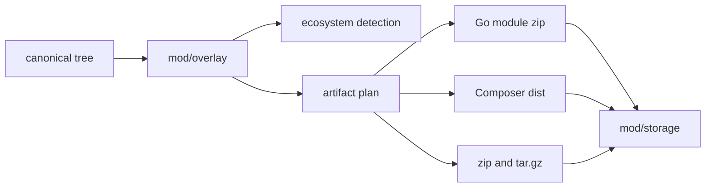

# mod/overlay

`mod/overlay` turns a canonical version tree into package-manager artifacts and metadata. It detects Go and Composer
packages, rewrites Go module paths for Go proxy artifacts when enabled, plans raw universal archives, and builds
artifact bytes from storage.

## Place in the Runtime

## Responsibilities

- Detect whether a tree is Go-publishable, Composer-publishable, both, or neither.
- Rewrite Go module paths and imports for the configured public module path in Go proxy module zips.
- Reject trees that cannot become valid Go module zips.
- Build Go proxy `.mod`, `.info`, and `.zip` artifacts.
- Build Composer metadata and dist archives.
- Build raw universal `.zip` and `.tar.gz` artifacts with top directory `<key>-<version>/`.
- Render install snippets and integrity hints used by the HTML UI.

## Contracts

- Detection must be deterministic from tree contents and listener/domain context.
- Go zip validity follows `golang.org/x/mod/zip` constraints, including fold collisions and invalid names.
- Symlink trees are not Go-publishable.
- Builders must not trust staged files after validation; storage reopens and verifies staged content before commit.
- Artifact identifiers include listener id when output depends on host or scheme; raw universal archives use the global
  listener id.

## Important Files

- `detect.go`, `goviability.go`: ecosystem detection and Go zip viability.
- `rewrite.go`: Go module path and import rewriting.
- `artifact.go`, `plan.go`: artifact planning.
- `go*.go`, `composer*.go`, `universal.go`: domain builders.
- `snippet.go`: UI install snippets.
- `interface.go`: storage and reader seams.

## Operational Notes

Overlay code is intentionally strict. A tree that is valid as a universal archive can still be blocked for Go if it
would produce a module zip that Go tooling rejects. The version remains published; only Go-specific artifacts are
disabled.
