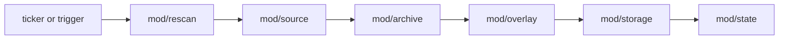
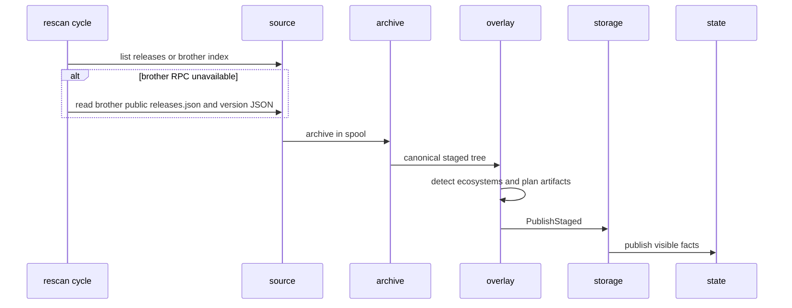

# mod/rescan

`mod/rescan` is the background integrator. It reads configured keys, discovers their sources, fetches or replicates
versions, builds overlay artifacts, and publishes completed versions into storage and state.

## Place in the Runtime

## Responsibilities

- Run the supervisor, ticker, manual trigger, and one-shot `RunOnce`.
- Process keys with bounded parallelism.
- Persist sticky git listing mode for releases-versus-tags decisions.
- Fetch git archives into a blob spool and pass them through archive extraction.
- Replicate brother versions by pulling index, tree bytes, and only missing blobs.
- Confirm `Brother.Hello` on each brother dial or redial before trusting the session.
- Fall back to a brother's public release API when RPC is closed or unavailable.
- Run detection and artifact planning before durable publication.
- Publish versions through `storage.PublishStaged`.
- Persist ingest failure/quarantine diagnostics for deterministic reject paths.
- Update composer name maps, content checksum, key stats, diagnostics, and deletion grace.

## Ingest Flow

## Contracts

- One key failure must not cancel the whole cycle.
- A single version that cannot be resolved from a brother's public API is skipped and retried next cycle; it never
  fails the whole listing and stays in the upstream set so deletion grace cannot remove it.
- A version becomes visible only after `PublishStaged` commits durable data.
- Blob spool cleanup must run even when the request context is canceled.
- Unsafe symlink targets are degraded deterministically: they are dropped before publication and counted, not followed.
- Permanent content failures are remembered by upstream reference or advertised tree hash to avoid repeated downloads.
- Rejects that happen before a version is indexed must leave diagnostic quarantine rows instead of durable partial
  versions.
- Brother tree bytes must match the tree hash announced in the brother index when that hash is non-zero.
- Public brother fallback must verify the downloaded archive against the tree hash announced by the public version JSON.
- Brother blob fetches must respect the negotiated byte and batch-count limits from the active session.

## Important Files

- `obj.go`: object dependencies and public facade.
- `supervisor.go`: lifecycle, trigger, and run loop.
- `ingest.go`: git ingest path.
- `brother.go`: brother replication and fallback logic.
- `cycle.go`: end-of-cycle aggregates.
- `deletion.go`: upstream deletion grace.
- `spool.go`: pre-commit blob reader used by overlay builders.
- `metrics.go`: rescan telemetry.

## Operational Notes

`rescan.initial_depth` controls how much history is fetched on first contact. Later cycles use provider ordering,
upstream sequence, semver rules, and configured deletion grace to avoid unnecessary downloads while still detecting
changed or removed releases.

Telemetry records version failure phases in `rescan_version_failures_total{phase=...}` and aggregates deterministic
degraded publishes, dropped unsafe symlinks, and unclassified Go module zip errors. JSON `/metrics/rescan` keeps the
stable public field set; phase-level detail is exposed through the internal/OpenMetrics view and push pipeline.
