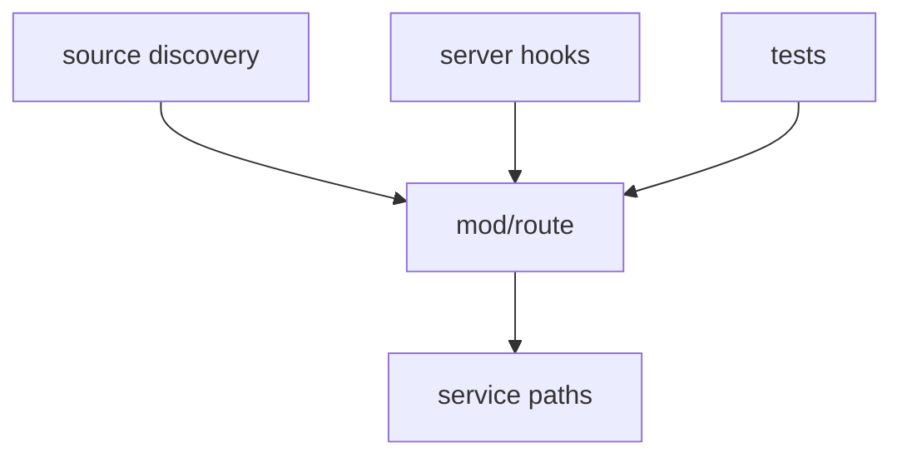

# mod/route

`mod/route` contains stable service route constants shared by server, source discovery, tests, and generated-facing
helpers. It prevents packages from spelling `/health`, `/info`, OpenAPI, metrics, and similar routes differently.

## Place in the runtime

## Responsibilities

- Define service-level routes that are independent of a package key or version.
- Define the public metrics groups, including the optional Yggdrasil snapshot at `/metrics/ygg`.
- Keep discovery probes and server handlers aligned.
- Provide one place to audit routes that are expected to be stable across deployments.

## Contracts

- Route constants are path-only strings beginning with `/`.
- Package-manager routes that depend on `{key}` or `{version}` stay with their domain builder.
- Adding a new public service route should update this package, the server handler, OpenAPI sources, and the relevant
  README.

## Important files

- `route.go`: service route constants.

## Usage notes

Do not put helper functions here unless they are shared by more than one package. Most URL building belongs in
`mod/server/link` because it needs listener, scheme, prefix, and host context.
