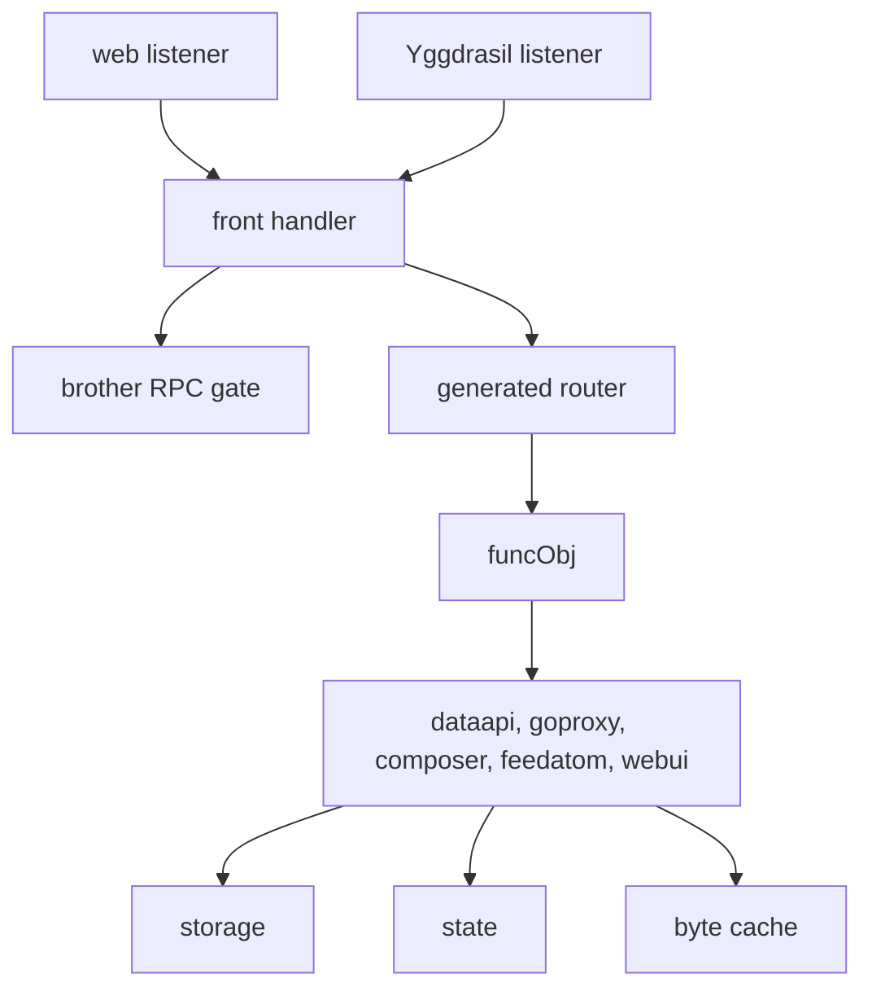
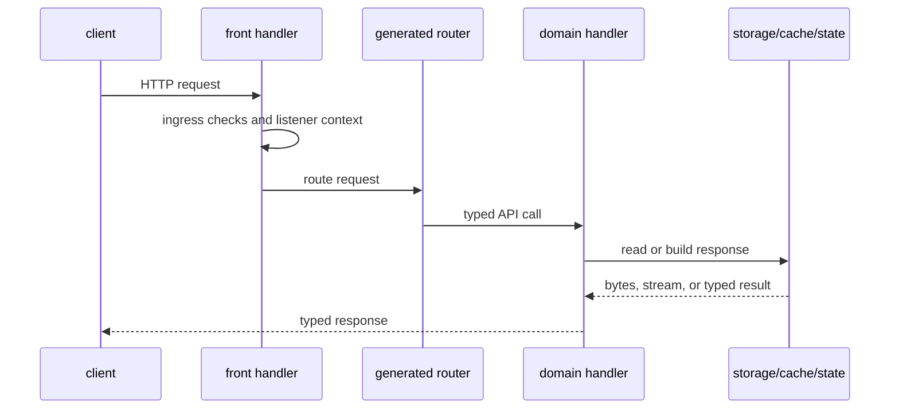

# mod/server

`mod/server` is the inbound serving layer. It accepts web and Yggdrasil HTTP traffic, applies ingress limits, routes
generated API calls, serves package-manager endpoints, renders the HTML UI, streams artifacts, exposes metrics, and
hosts brother RPC on enabled web and Yggdrasil entries. The same public release and artifact routes can also be used
by a brother as a read-only fallback when RPC is disabled.

## Place in the runtime

## Responsibilities

- Start listeners for `single`, `shared`, `split`, and Yggdrasil modes.
- Add listener context, request id, method gate, URI cap, rate limits, and route-prefix handling.
- Implement generated `api.FuncInterface` handlers.
- Serve JSON APIs, Go proxy routes, Composer routes, Atom feeds, HTML UI, OpenAPI, sitemap, logos, favicon, and OG
  images.
- Stream large artifacts with `ETag`, `Last-Modified`, `Content-Length`, `Range`, and `HEAD` support.
- Gate brother RPC per listener with `brother.rpc.web_enabled` and `brother.rpc.ygg_enabled`.
- Keep public release metadata and universal archives usable for brother fallback even when `/rpc` is disabled.
- Expose public JSON metric groups, including aggregate Yggdrasil state, and optional internal Prometheus text.

## Request flow

## Contracts

- Business handlers do not write directly to `http.ResponseWriter`; they return generated response types.
- Artifacts stream from disk or builders, not through unbounded RAM buffers.
- HTML builders must use request context so canceled clients stop expensive storage work.
- RPC is fail-closed when disabled for the current listener.
- `/rpc` accepts only `CONNECT`; normal HTTP methods do not enter the RPC server.
- Public fallback uses normal generated routes, so reverse proxies handle it like ordinary read-only client traffic.
- Metrics labels must stay low-cardinality.
- `/metrics/ygg` must return 404 when the mesh is disabled. Per-peer details require internal metrics on the current
  listener; aggregate values remain available with public metrics alone.
- Cold metadata and typed-object cache misses share the configured cache build gate.
- Generated sitemap bodies are capped at 8 MiB in addition to `web.pages.sitemap_size`; generated Atom feeds cap release
  notes at 64 KiB per entry before markdown rendering and cap the final XML document at 4 MiB.

## Two caches

Server responses use two different process-local caches:

| Cache                       | Stores                      | Budget                    | Eviction                 | Metrics | Use for                                                                 |
|-----------------------------|-----------------------------|---------------------------|--------------------------|---------|-------------------------------------------------------------------------|
| `cachedBytes` / `mod/cache` | final byte bodies plus ETag | `cache.metadata_max_size` | sharded LRU by byte size | yes     | XML, JSON, HTML, sitemap, Atom feed and other already-rendered payloads |
| `cachedObj` / `objCache`    | typed ogen objects          | about `2 * 4096` entries  | two-generation map       | no      | Composer p2 objects and Go `@latest` objects                            |

New byte-oriented responses must go through `cachedBytes`, because it has byte accounting and low-cardinality cache
metrics. `cachedObj` is deliberately limited to typed objects that would otherwise be serialized only to measure their
size. Both caches share the same detached-build gate, so cold clients cannot start unbounded independent builds.

The typed cache has no byte accounting or metrics. That is a known limitation rather than an omission in `mod/cache`.

## Important files

- `server.go`, `deps.go`, `listener.go`: assembly and lifecycle.
- `front.go`, `hooks.go`, `respond.go`, `errors.go`: common HTTP frame.
- `funcimpl*.go`: generated API handler implementation.
- `artifact.go`, `objcache.go`, `metrics.go`, `assets.go`: artifact serving, response cache, metrics, built-in assets.
- `brother/`: RPC server.
- `dataapi/`, `goproxy/`, `composer/`, `feedatom/`, `webui/`: domain response builders.

## Operational notes

`shared` mode is for a TLS-terminating reverse proxy where the public scheme is HTTPS but the process listens on one
plain HTTP socket. `split` mode is for separate HTTP and HTTPS binds. `single` mode is simplest for local development.
Brother RPC is mounted before the generated API router, so the OpenAPI route list does not describe it. Public fallback
uses generated API and artifact routes and therefore follows the same prefix, cache, and proxy behavior as normal
clients.

Artifact and key lookups are scoped to the current listener context. A web request must not fall back to a Yggdrasil
listener key, or the reverse case, when selecting generated artifact URLs.

In nested mode (`web.static.dir` set) per-key API routes move under `web.routing.prefix`, but service routes stay at
their well-known root paths. `/info` therefore stays reachable at the root and advertises `route_prefix`: empty when the
API is served at the root, otherwise the mounted segment. A brother reads this field during discovery to derive remote
keys under the prefix the node actually serves.

The byte cache stores generated metadata responses, including sitemap and Atom feed bodies. The sitemap byte cap stays
well below the protocol limit of 50 MB, and the feed caps prevent large release notes from evicting unrelated metadata
from the RAM cache. Changing those constants does not require an ETag format change: the cache is process-local RAM and
new bodies are built on the next miss or restart.
