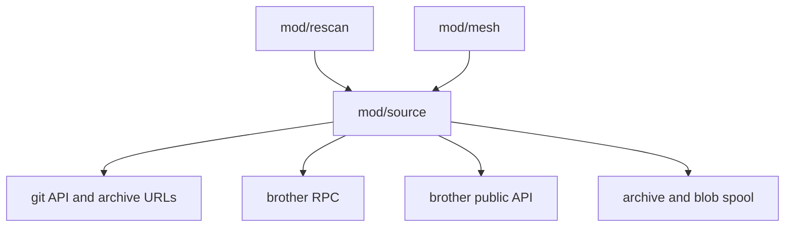
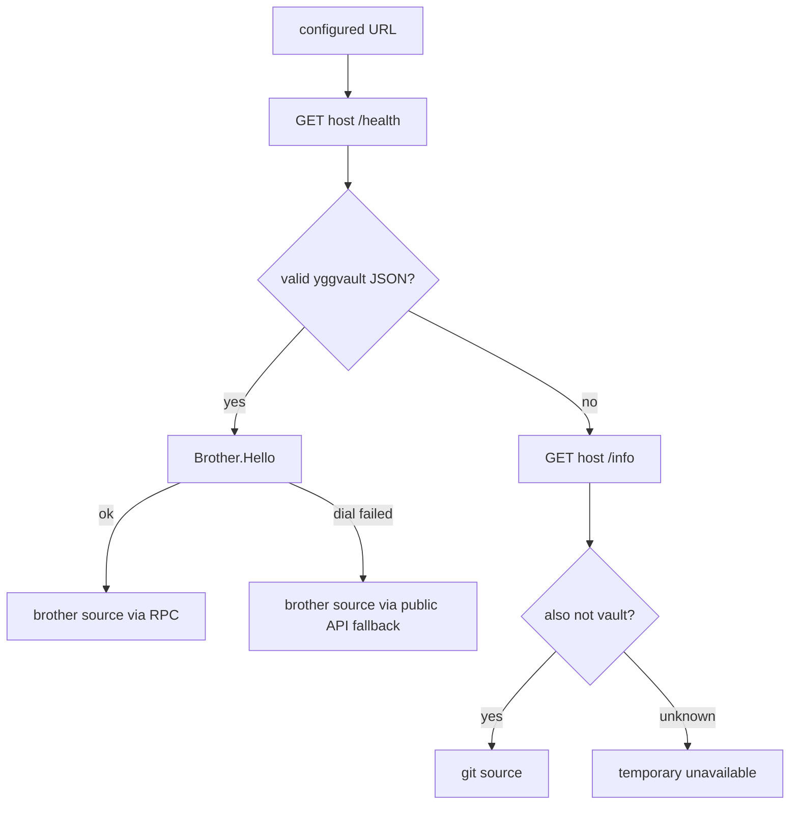

# mod/source

`mod/source` is the outbound network layer. It classifies a configured upstream as either a git forge or another
yggvault node, downloads release archives, speaks brother RPC over HTTP CONNECT, and can read a brother's public
release API when RPC is unavailable. It owns egress safety: routed dials, retry policy, credentials, redirects, SSRF
checks, bounded RPC decoding, and bounded public metadata reads.

## Place in the runtime

## Responsibilities

- Classify sources through `/health`, `/info`, and brother `Hello`.
- Fetch git releases and tags from supported providers.
- Download release archives into a caller-owned spool path.
- Resume interrupted downloads when validators and `Range` support allow it.
- Route `.pk.ygg` traffic through the embedded mesh and public hosts through guarded clearnet dials.
- Add provider credentials only for matching provider hosts.
- Apply a per-host outbound limiter to upstream HTTP clients and export request/wait metrics.
- Open brother sessions and pull index pages, version tree bytes, and blob batches.
- Read public `releases.json`, release detail JSON, and universal archive URLs from a brother when RPC cannot be used.
- Negotiate brother blob-fetch byte and batch limits through `Brother.Hello`.
- Enforce redirect, response, gob, body, throughput, and private-address limits.

## Discovery flow

Large non-JSON `/health` or `/info` bodies are treated as non-vault responses. This keeps public git forges such as
GitHub from being stuck in "classification deferred" when they return HTML at service-looking paths.

For a confirmed brother, the remote key is derived from the configured URL path under the prefix the remote node
actually serves: discovery reads `route_prefix` from the brother's `/info` and strips that segment (for example
`http://host/pkg/key` under `route_prefix=pkg` yields `key`). Nodes that omit `route_prefix` (older instances) fall
back to the local `web.routing.prefix`, so existing deployments keep resolving keys unchanged.

## Contracts

- All dials and requests must carry deadlines.
- Clearnet dials reject loopback, private, link-local, multicast, reserved, and Yggdrasil ranges after DNS resolution.
- Credentials never cross from clearnet into Yggdrasil or another host.
- Brother payloads are verified by size and BLAKE3-24 hash before they are staged.
- Brother index pagination uses the remote keyset cursor when `Brother.Hello` advertises support; page-number fallback
  remains for older nodes.
- Brother web and Yggdrasil addresses share the same RPC protocol; transport order is a rescan/config decision.
- `source.rate_limit` is per upstream host. It limits git provider calls, archive downloads, brother RPC HTTP
  transports, and public brother fallback reads without labeling metrics by arbitrary URLs.
- Public brother fallback accepts only universal `tree-targz` or `tree-zip` artifacts and returns the advertised tree
  hash so rescan can verify the downloaded archive before publishing.
- Public brother fallback isolates per-version detail failures: it reports every listed version name for deletion
  safety, resolves details only for versions the caller does not skip, and never fails the whole listing on one bad
  version. The caller-supplied skip predicate avoids re-fetching details for versions already stored.
- This package does not parse archives and does not commit storage.

## Important files

- `obj.go`: object shape, constructor, and public DTOs.
- `client.go`: HTTP clients, routed dialer, probes, archive streaming.
- `ratelimit.go`, `metrics.go`: per-host limiter and outbound source metrics.
- `discovery.go`: source classification and remote-key derivation.
- `git.go`, `refs.go`, `info.go`: git provider listing, refs fallback, and source metadata.
- `public_mirror.go`: public yggvault release API fallback for brother sources without RPC.
- `brother.go`, `brother_codec.go`: brother session and bounded gob codec.
- `ssrf.go`, `auth.go`, `retry.go`: egress guard, credentials, and retry policy.

## Operational notes

The download client intentionally has no global `http.Client.Timeout`; streaming is bounded by request context,
archive size, idle timeout, and throughput floor. This allows large valid archives to finish while still stopping
stalling or drip-fed responses.

Keep limiter labels low-cardinality. The limiter tracks a bounded set of hosts internally, but exported metrics describe
request class and outcome rather than raw upstream names.
