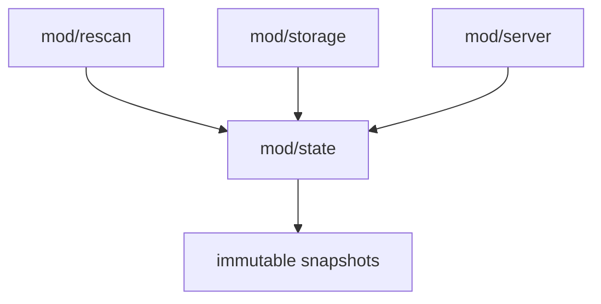

# mod/state

`mod/state` holds the process-local runtime snapshot: key availability, latest versions, source classification,
diagnostics, content checksum, and small serving metadata. It is rebuilt from config and storage during runtime and is
not the durable source of truth.

## Place in the runtime

## Responsibilities

- Keep fast read snapshots for server handlers.
- Track key state, availability, source class, latest version, and version count.
- Track active diagnostics and recent dropped diagnostics.
- Publish freshness changes for metadata ETags.
- Provide concurrency-safe reads without exposing mutable internal maps.

## Contracts

- Storage remains durable truth. State can be rebuilt.
- Writers update state through methods that publish snapshots atomically. One internal mutex serializes all mutations
  and
  snapshot publication.
- Reads are lock-free: public read methods load immutable snapshots through an atomic pointer.
- Readers receive copies or immutable values and must not mutate internal maps.
- Diagnostic messages are user-facing and must be in English.
- The diagnostic registry is capped at 4096 records. On overflow, the oldest deactivated record is evicted in O(1);
  active diagnostics are never evicted. If the registry is full of active records, the new diagnostic is dropped and the
  dropped counter is incremented.
- Deactivated diagnostics keep first-seen, last-seen, and count data until evicted by registry pressure.
- `ClearVersionDiagnostics` is intentionally cheap when there is nothing to clear: it must not publish a new snapshot or
  bump the generation in that case.

## Important files

- `obj.go`: public types, state object, and internal mutable record types.
- `init.go`: construction from config and initial snapshot publication.
- `method.go`: key-domain mutations and mirror statistics.
- `registry.go`: diagnostic registry, key/version diagnostic clearing, and O(1) inactive eviction.
- `availability.go`: upstream availability transitions.
- `checksum.go`: content checksum publication.
- `snapshot.go`: lock-free reads and snapshot construction.
- `helper.go`: validation, key index construction, and snapshot publication helpers.
- `metrics.go`: state-related metrics.

## Operational notes

State updates should be cheap. Expensive work such as storage scans, archive checks, and artifact builds belongs in
`mod/rescan` or `mod/storage`; state should only publish the resulting facts.

Full snapshot rebuilds happen on structural diagnostic changes. Key mutations use incremental snapshot publication and
are gated on actual state changes; no-op clears and repeated unchanged writes should not advance `Generation`.
