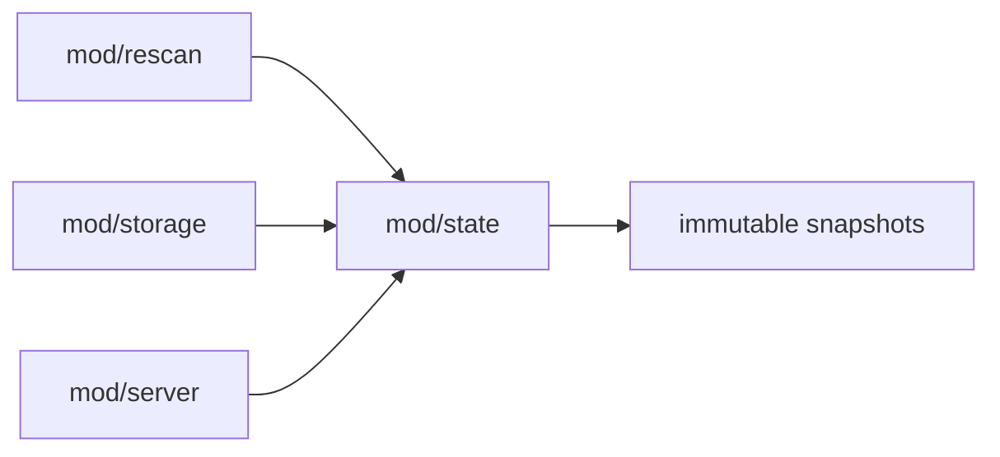

# mod/state

`mod/state` holds the process-local runtime snapshot: key availability, latest versions, source classification,
diagnostics, content checksum, and small serving metadata. It is rebuilt from config and storage during runtime and is
not the durable source of truth.

## Place in the Runtime

## Responsibilities

- Keep fast read snapshots for server handlers.
- Track key state, availability, source class, latest version, and version count.
- Track active diagnostics and recent dropped diagnostics.
- Publish freshness changes for metadata ETags.
- Provide concurrency-safe reads without exposing mutable internal maps.

## Contracts

- Storage remains durable truth. State can be rebuilt.
- Writers update state through methods that publish snapshots atomically.
- Readers receive copies or immutable values and must not mutate internal maps.
- Diagnostic messages are user-facing and must be in English.

## Important Files

- `obj.go`: state object and internal locks.
- `method.go`, `snapshot.go`: public reads and snapshot publishing.
- `key.go`, `diagnostic.go`, `checksum.go`: main state domains.
- `metrics.go`: state-related metrics.

## Operational Notes

State updates should be cheap. Expensive work such as storage scans, archive checks, and artifact builds belongs in
`mod/rescan` or `mod/storage`; state should only publish the resulting facts.
