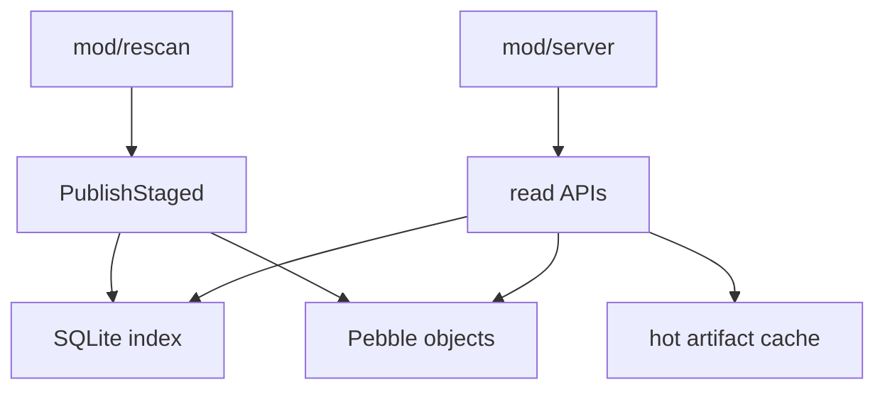
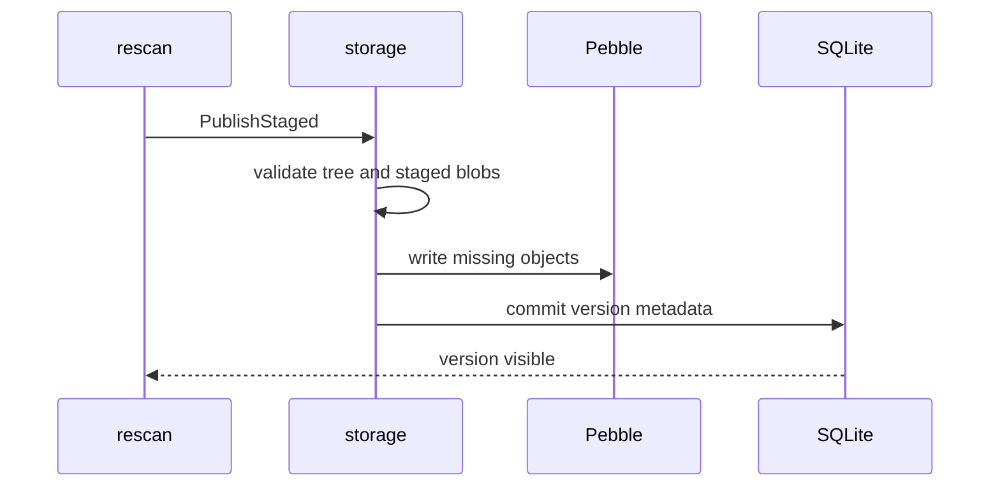

# mod/storage

`mod/storage` is the durable data layer. It stores canonical blobs and trees in Pebble, metadata and indexes in
SQLite, and regenerated serving artifacts in a bounded hot-file cache. It is the source of truth for published
versions.

## Place in the Runtime

## Responsibilities

- Validate staged entries and blobs before commit.
- Write missing blobs and tree objects into Pebble.
- Commit version metadata, artifacts, detections, events, and key sources into SQLite.
- Serve blobs, trees, versions, artifacts, key lists, feeds, and checksums.
- Maintain hot artifacts and enforce storage quotas.
- Provide maintenance operations for inspect, prune, vacuum, compaction, and cache rebuild.

## Publish Boundary

## Contracts

- `PublishStaged` is the visibility boundary. Partial staged data must not become public.
- Blobs are addressed by BLAKE3-24 and verified before write.
- Hot-cache files are disposable; Pebble and SQLite are durable truth.
- Blob read/write paths materialize whole blobs, so configured per-file limits and in-flight read budgets are required.
- Generated cache rebuilds must be deterministic for the same stored tree and listener context.

## Important Files

- `obj.go`, `open.go`: storage object and startup.
- `staged.go`, `version.go`: publish path and version metadata.
- `pebble.go`, `pebblestore/`: object store integration.
- `sqliteindex/`: SQL schema and index queries.
- `hot.go`, `quota.go`, `maintenance.go`: hot cache, quota, and maintenance.
- `validate.go`: archive and storage limit enforcement.

## Operational Notes

For tuning compression, memtables, block cache, CGO builds, and hot-cache verification, use the root
`STORAGE-TUNING.md`. This README describes package boundaries; tuning profiles describe operator choices.
