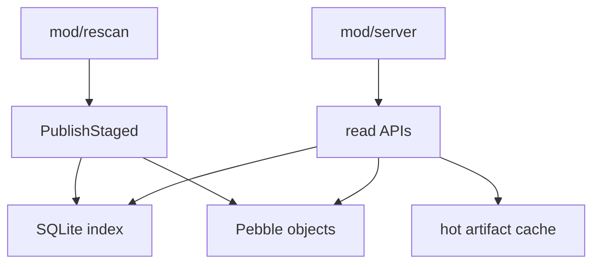
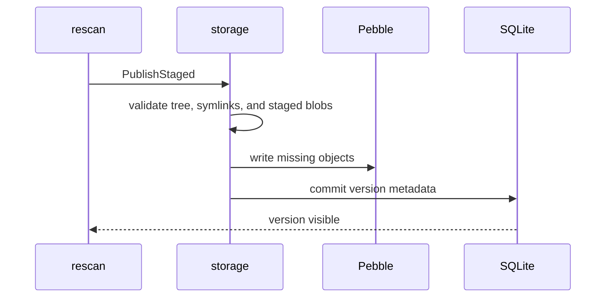

# mod/storage

`mod/storage` is the durable data layer. It stores canonical blobs and trees in Pebble, metadata, quarantine records,
and indexes in SQLite, and regenerated serving artifacts in a bounded hot-file cache. It is the source of truth for
published versions and ingest failure state.

## Place in the runtime

## Responsibilities

- Validate staged entries and blobs before commit.
- Write missing blobs and tree objects into Pebble.
- Commit version metadata, artifacts, detections, events, and key sources into SQLite.
- Record ingest failures and quarantine state for rescan diagnostics and retry decisions.
- Serve blobs, trees, versions, artifacts, key lists, feeds, and checksums.
- Maintain hot artifacts and enforce storage quotas.
- Provide maintenance operations for inspect, prune, vacuum, compaction, and cache rebuild.

## Publish boundary

## Contracts

- `PublishStaged` is the visibility boundary. Partial staged data must not become public.
- Symlink targets are checked again before durable blob writes. A rejected staged tree must not leave indexed blobs or a
  visible version behind.
- Blobs are addressed by BLAKE3-24 and verified before write.
- Hot-cache files are disposable; Pebble and SQLite are durable truth.
- Blob read/write paths materialize whole blobs, so configured per-file limits and in-flight read budgets are required.
- Generated cache rebuilds must be deterministic for the same stored tree and listener context.

## Lock order

Storage locks are taken one at a time. The only permitted nesting is `writeMu -> hotActiveMu`; no code may acquire
another storage lock while already holding `hotActiveMu`, `flightMu`, `metricRegMu`, or `closeMu`.

| Lock                   | Role                                                                | Nesting                                              |
|------------------------|---------------------------------------------------------------------|------------------------------------------------------|
| `writeMu`              | serializes publish, quota, durable metadata and hot-cache mutations | may call helpers that take `hotActiveMu`             |
| `hotActiveMu`          | tracks active and pending-delete hot files                          | leaf lock; can be entered under `writeMu` only       |
| `flightMu`             | protects the map of in-flight hot artifact builds                   | leaf lock                                            |
| `metricRegMu`          | protects OTel callback registrations                                | leaf lock                                            |
| `closeMu`              | guards lifecycle close state                                        | leaf lock                                            |
| `BlobSpoolObj.closeMu` | guards one temporary staging directory                              | independent spool lock, not part of `Obj` lock order |

Known backlog:

- `buildHotFile` currently holds `writeMu` through filesystem work while enforcing the hot-cache budget. That can block
  publishes under a cold-cache miss and should be split in a dedicated performance pass.
- Large Go zip rewrites above the small rewrite cache threshold can read and scan the same blob twice. Hot artifacts
  mitigate repeated requests, but a measured single-materialization optimization is still possible.

## Important files

- `obj.go`, `init.go`: storage object and startup.
- `staged.go`, `version.go`: publish path and version metadata.
- `quarantine.go`, `sqliteindex/quarantine.go`: ingest failure and quarantine persistence.
- `pebble.go`, `pebblestore/`: object store integration.
- `sqliteindex/`: SQL schema and index queries.
- `hot_build.go`, `hot_path.go`, `quota.go`, `maintenance.go`: hot cache, quota, and maintenance.
- `validate.go`: archive and storage limit enforcement.

## Operational notes

For tuning compression, memtables, block cache, CGO builds, and hot-cache verification, use the root
`STORAGE-TUNING.md`. This README describes package boundaries; tuning profiles describe operator choices.

Rejected ingest paths are deliberately durable only as diagnostics. Rescan can read quarantine rows to decide whether a
version is retryable, permanently failed, or ready for repair, but rejected blobs are not part of the public index. If a
fallback publish path writes blobs before the final gate, prune/repair must be able to remove blobs that no indexed tree
references.
