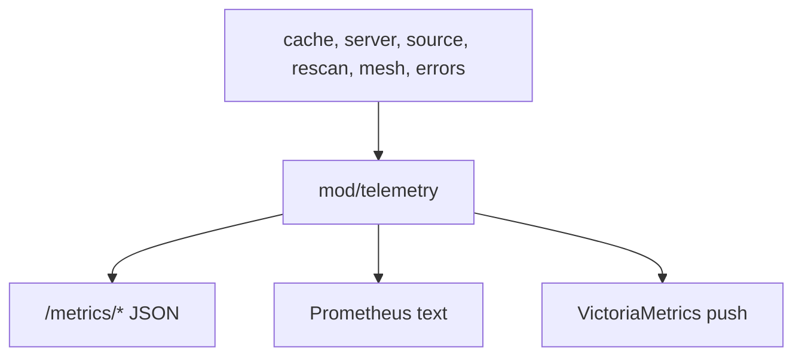

# mod/telemetry

`mod/telemetry` collects runtime metrics snapshots and optionally pushes them to VictoriaMetrics. The server exposes
selected metric groups as JSON and, when enabled, a full Prometheus text view.

## Place in the runtime

## Responsibilities

- Register metric producers from runtime packages.
- Build stable metric snapshots for HTTP handlers.
- Format selected data as JSON metric groups.
- Format the internal Prometheus text exposition.
- Push metrics to VictoriaMetrics when configured.

## Contracts

- Metric labels must stay low-cardinality. Do not label by arbitrary key, version, URL, or request id.
- Source outbound limiter metrics must not expose raw upstream hosts.
- Snapshot collection must be bounded and must not block hot serving paths for long.
- Push failures are non-fatal. They should be visible in logs and error metrics, not crash the process.
- Public JSON metric groups should remain understandable to an operator without Prometheus tooling.

## Important files

- `obj.go`: telemetry object and producer registry.
- `snapshot.go`: collection flow.
- `render.go`: Prometheus text exposition.
- `values.go`: low-cardinality snapshot value accumulation.
- `spec.go`: shared observable metric registration.
- `push.go`: VictoriaMetrics import path.

## Operational notes

Use `/metrics/{core,cache,errors,rescan,ygg}` for human-readable diagnostics. The Yggdrasil group is available only
while the mesh is running; it stays aggregate-only unless internal metrics are also enabled for the listener. Rescan
snapshots include source outbound request and limiter-wait signals, plus version failure phase counters. Enable
`/metrics/internal` only when a scraper or trusted internal network needs the full exposition.
