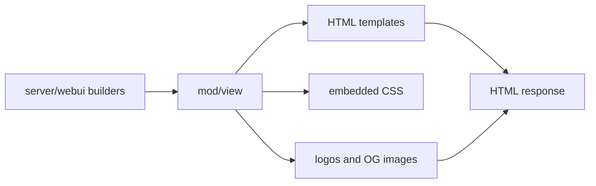

# mod/view

`mod/view` contains typed view models, templates, CSS, and generated visual assets for the HTML interface. It is a
rendering package: server and webui builders prepare data, then `mod/view` turns it into HTML, PNG, or small static
assets.

## Place in the Runtime

## Responsibilities

- Define view models for catalog, key, version, metrics, and shared context.
- Render HTML templates with embedded CSS and small scripts.
- Render built-in logos and Open Graph PNG banners.
- Keep HTML escaping and Markdown rendering boundaries clear.
- Keep UI text consistent across web entry and Yggdrasil entry.

## Contracts

- View models should already contain display-ready facts. Templates should not query storage or state.
- Release notes Markdown is sanitized before rendering.
- PNG generation must be deterministic for the same input.
- CSS and HTML should avoid layout assumptions that break long keys, versions, hashes, or Yggdrasil addresses.

## Important Files

- `*.go`: view models and render helpers.
- `templates/`: HTML templates and stylesheet.
- `logo.go`, `media.go`: generated images and media helpers.
- `markdown` integration is handled before release notes reach templates.

## Operational Notes

The UI is operational rather than marketing-oriented. It should favor dense, readable package information, stable
navigation, copyable hashes, and install snippets over decorative content.
