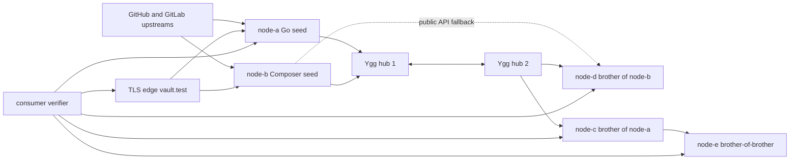

# tests

`tests` contains the live integration harness for yggvault. Unit tests cover package behavior; this directory verifies
that real nodes can ingest upstream releases, replicate over Yggdrasil, serve package-manager clients, and terminate
TLS through the edge proxy. It also checks that the read-only brother RPC handshake is reachable on the web listener.
One Composer brother path intentionally disables RPC on its seed and verifies replication through the public release
API fallback.

## Stack



## What It Verifies

- Git seed ingest for Go module releases.
- Composer seed ingest and p2 metadata.
- Brother replication across two Yggdrasil hubs.
- Brother replication through public API fallback when the seed's RPC is disabled.
- Brother-of-brother replication for multi-hop convergence.
- Brother RPC `Hello` over the web listener.
- Go proxy consumption with real `go get` and `go build`.
- Composer resolution, dist checksum, and TLS dist extraction.
- Bazel and Zig snippets against served universal archives.
- TLS edge behavior with the generated test CA.

## Main Files

- `docker-compose.yml`: two hubs, five vault nodes, TLS edge, verifier container.
- `scripts/bootstrap.sh`: generated keys, configs, certificates, and topology.
- `scripts/up.sh`: stack startup, GitHub quota preflight, optional verifier.
- `scripts/down.sh`: stack shutdown and optional cleanup.
- `verifier/run-tests.sh`: consumer checks run inside the verifier container.
- `stub/`: committed Go and Composer consumer fixtures.

## Running

Use existing images:

```bash
bash tests/scripts/up.sh --no-build --verify
bash tests/scripts/down.sh
```

Build images first:

```bash
bash tests/scripts/up.sh --verify
bash tests/scripts/down.sh
```

Clean generated state:

```bash
bash tests/scripts/down.sh --clean
```

## GitHub Quota

The seed nodes query GitHub. `tests/scripts/up.sh` checks the unauthenticated quota before startup. If quota is low,
the verifier can fail for upstream reasons rather than product reasons. Set `GITHUB_TOKEN` in the environment when a
full run needs authenticated GitHub API budget; bootstrap writes that token into generated seed configs under
`tmp/tests`, so use short-lived test tokens and clean the directory when done.

## Generated Files

`tmp/tests` is disposable. It contains generated configs, keys, certificates, logs, storage, verifier output, and the
topology note printed by bootstrap.
