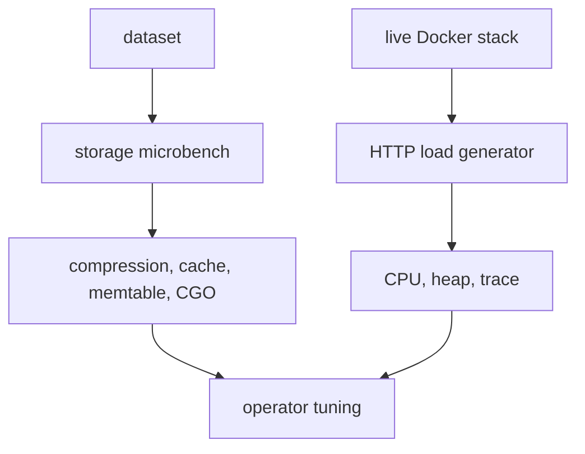

# tests/bench

`tests/bench` contains repeatable performance probes for storage and live serving paths. The goal is not to replace
Go benchmarks; these scripts exercise the same binaries, configs, caches, and HTTP paths used by the integration
stack.

## Bench Areas



## Responsibilities

- Compare storage compression and cache settings on the same dataset.
- Measure write cost, cold reads, warm reads, disk size, allocation, and RSS.
- Drive live HTTP endpoints with keepalive load.
- Capture pprof CPU, heap, goroutine, and runtime trace snapshots.
- Keep benchmark results outside committed source.

## Main Files

- `storage/`: Go storage microbench driver.
- `loadgen/`: small HTTP load generator used by shell scripts.
- `run.sh`: storage benchmark wrapper.
- `highload.sh`: live serving load wrapper.
- `system.sh`: live stack benchmark with pprof and trace capture.
- `system-sweep.sh`: full stack profile and sweep wrapper.

## Typical Runs

Storage profile:

```bash
DATASET="$HOME/go/pkg/mod" REPS=3 bash tests/bench/run.sh
```

Live serving profile:

```bash
bash tests/scripts/up.sh --no-build
CONC=200 DUR=20 bash tests/bench/highload.sh
bash tests/scripts/down.sh
```

## Reading Results

Use storage numbers to choose compression and Pebble memory settings. Use live results to check whether serving is
limited by hot-cache misses, artifact rebuilds, TLS edge, or HTTP concurrency. Always record the dataset, CPU, Go
version, CGO mode, and config profile with any benchmark result you compare later.

## Safety Notes

The high-load scripts target local test ports. Do not point them at a public node unless the operator explicitly wants
that load. Profiles can contain paths, module names, and timing data, so treat result directories as operational data.
